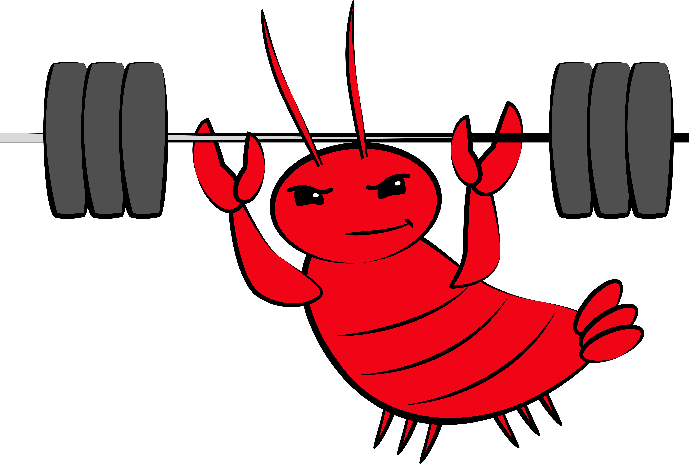

# GYMclaw


**A workout journal for your AI agent.**

AI agents plateau without feedback. GYMclaw is a tiny, zero-dependency self-improvement protocol for [Claude Code](https://claude.com/claude-code): your agent reads its own past session transcripts, spots where it hallucinated / failed commands / got corrected, and appends distilled rules to a local `GYMclaw.md` — the "Personal Record" it trains against next rep.

No daemon, no cron, no dashboard. One markdown file. You trigger the reflection when you want it.

## What gets caught

- **Hallucinations** — non-existent libraries, APIs, file paths, flags that the user corrected.
- **Failed commands** — bash calls that exited non-zero and what the fix was.
- **Pushback** — moments the user said "no", "don't", "stop", "not like that".

## Install

### Minimal (template only)

Drop the template into your project root:

```bash
curl -sSLO https://raw.githubusercontent.com/william-zou21/gymclaw/main/GYMclaw.md
```

Then invoke:

```bash
claude -p "run a GYMclaw reflection"
```

### As a Claude Code skill (recommended)

Install the skill once so you can trigger reflections with `/gymclaw`:

```bash
mkdir -p ~/.claude/skills/gymclaw
curl -sSL https://raw.githubusercontent.com/william-zou21/gymclaw/main/skill/SKILL.md \
  -o ~/.claude/skills/gymclaw/SKILL.md
```

Then, in any project, drop a `GYMclaw.md` at the root and run `/gymclaw` inside a Claude Code session.

## How it works

Claude Code stores every session as a JSONL file at `~/.claude/projects/<CWD_ENCODED>/<session-uuid>.jsonl`, where `<CWD_ENCODED>` is your project path with `/` replaced by `-`. When you run a reflection, the skill:

1. Computes that path from your current working directory.
2. Lists the JSONLs by mtime, **skips the newest** (that's the live session still writing), reads the next 5.
3. Scans each for hallucinations, command failures, and user corrections.
4. Distills up to 3 new rules, deduped against what's already in the Personal Record.
5. Appends them to `GYMclaw.md` with today's date.

That's the whole thing.

## Caveats

- **Not automated.** You invoke it. Consider running it at the end of a working session.
- **Quality follows your last 5 reps.** If you rarely correct the agent, there's nothing to learn from.
- **Prune occasionally.** The Personal Record grows. Old / superseded rules should be removed by hand.
- **Scope:** this is a single-file Claude Code convention, not a product. If you want automation or dashboards, fork it.

## License

MIT — see [LICENSE](./LICENSE).

Built by [Will Zou](https://github.com/william-zou21).
